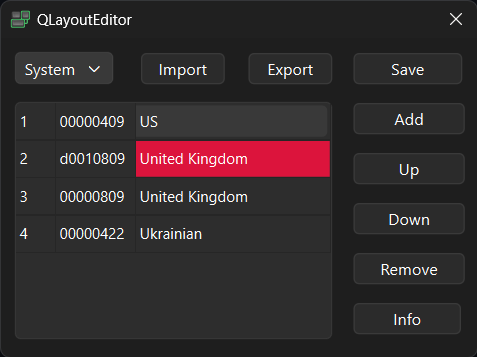

# QLayoutEditor

Windows 11 Layout editor

## Problem:
Windows 11 often breaks Layouts dugin update

QLayoutEditor was made to do 2 things:

1) Provide direct access to layout config in Windows 11 Registry.

2) Change and remove broken layouts, that Windows does not allow.

The problem has appeared several times after an update in Window 11.

A couple of layouts appeared, and they could not be removed via Windows 11 settings.

Also, it appears sometimes layouts have broken IDs, that remind normal. Example is in the picture, `d0010809` is not a valid Layout, but Windows 11 detects it as 'United Kingdom'.

## How to use:

This tool lets you view and edit the keyboard layout list stored in the Windows registry, and apply changes to your current session without logging out.

Quick start:

• **User** / **System** — switch between the per-user and system-wide layout lists

• **Add** / **Remove** — add or remove keyboard layouts

• **Up** / **Down** — reorder layouts (topmost is the default)

• **Save** — write changes to the registry and reload layouts live

• **Import** / **Export** — back up or restore your layout list as JSON

Click Info at any time to learn more about the app.

Please let me know about the problems if/when you find any.

App icon is based on [elementary icons](https://github.com/elementary/icons).

### How to do the same without an app:

And yes, you could go to a register, and figure it out which ones are normal layouts, which ones are redundant.

For that you would need to go to `HKEY_CURRENT_USER\Keyboard Layout\Preload` and `HKEY_USERS\.DEFAULT\Keyboard Layout\Preload`, and look for values.
And also you'd need to validate layout IDs against [Microsoft's data](https://learn.microsoft.com/en-us/windows-hardware/manufacture/desktop/windows-language-pack-default-values?view=windows-11)

Also, please note, some languages, like Japanese, Korean and Chinese require an IME System and a language pack. Hence, simple addition of these languages does not make it appear as an input method. Please to not add these languages if you don't have Language Packs and/or if you don't know what you are doing.